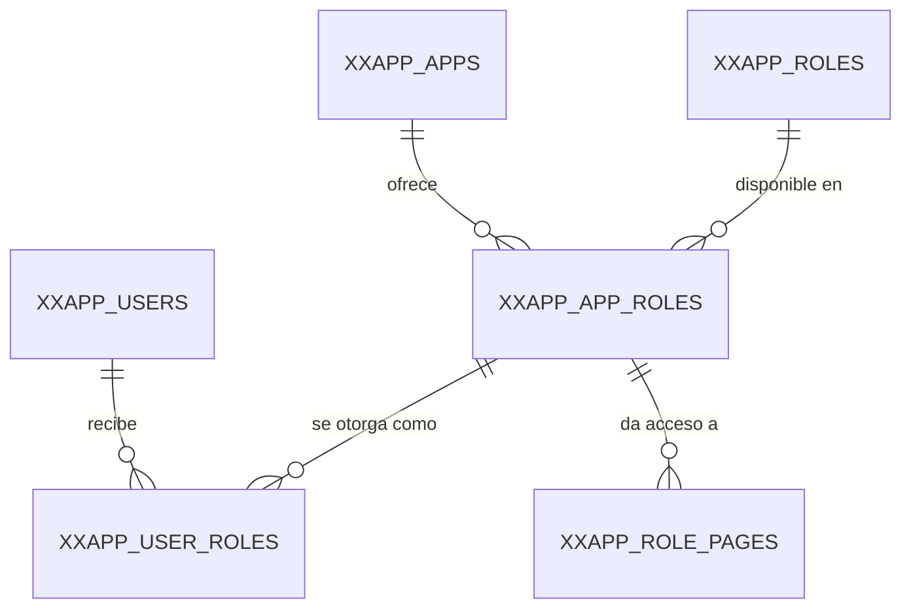

# Arquitectura del caso práctico

Las guías usan como ejemplo un mismo sistema: tres aplicaciones APEX que comparten usuarios, roles y permisos. Este documento explica cómo está armado, para que los ejemplos de las guías se entiendan sin tener el workspace abierto.

El planteamiento original está en la [bitácora](bitacora.md).

## Las tres aplicaciones

| Aplicación          | Prefijo   | Para qué sirve |
|---------------------|-----------|----------------|
| Application Manager | `XXAPP`   | Mantiene apps, usuarios, roles y el acceso a páginas. |
| Application Vault   | `XXVAULT` | Entrada principal. Muestra las apps que los roles del usuario permiten y comparte la sesión con ellas (SSO). |
| Laboratory          | `XXLAB`   | Donde se practican funcionalidades de APEX. |

Las tres viven en un solo esquema gratuito; el prefijo de los objetos hace las veces de esquema. Hoy solo existen objetos `XXAPP`.

Las aplicaciones (páginas, componentes compartidos, esquemas de autenticación) están en el workspace y no se exportan a este repositorio. Aquí solo están los objetos de base de datos, en [db/](../db/).

## Modelo de acceso

`XXAPP_APPS`, `XXAPP_USERS` y `XXAPP_ROLES` son catálogos independientes. Los roles son globales: `ADMIN` es el mismo rol en todas las apps.

`XXAPP_APP_ROLES` hace que un rol esté disponible en una app, y de su `APP_ROLE_ID` cuelga todo lo demás:

- `XXAPP_USER_ROLES` = usuario × `APP_ROLE_ID`. A un usuario se le da un rol *dentro de una app*, nunca un rol suelto.
- `XXAPP_ROLE_PAGES` = `APP_ROLE_ID` × número de página de APEX, con `CAN_READ` y `CAN_WRITE`.

`XXAPP_APPS.APP_APEX_ID` enlaza cada registro con el ID real de la aplicación en APEX. Con él el login encuentra la app actual y las consultas a `apex_application_pages` encuentran sus páginas. Los IDs de los datos de ejemplo del DDL (100 a 102) son de relleno: hay que cambiarlos por los de tu workspace.

## Login

El esquema de autenticación personalizado de APEX llama a `XXAPP_AUTH_PKG.PROCESS_LOGIN`:

1. `PROCESS_LOGIN` pasa el usuario a mayúsculas y llama a `HAS_ACCESS`.
2. `HAS_ACCESS` busca al usuario en `XXAPP_CREDENTIALS_V` para la app de `V('APP_ID')`.
3. La vista responde `HAS_ACCESS = 'Y'` si el usuario tiene al menos un rol habilitado en esa app.

Cómo configurarlo, y lo que le falta, está en [Login personalizado](guias/login-personalizado.md).

## Dónde vive el código

Las páginas de APEX no llevan SQL ni DML escritos en la región:

- **Lecturas.** Cada origen de reporte, LOV, grid o cards es una función de `XXAPP_QUERIES_PKG` que devuelve el texto SQL. Ver [Consultas en paquete](guias/queries-pkg.md).
- **Escrituras.** Los Interactive Grid guardan llamando a un paquete por entidad (`XXAPP_ROLES_PKG`, `XXAPP_APP_ROLES_PKG`). Ver [Interactive Grid](guias/interactive-grid.md).
- **Consultas grandes o reutilizadas.** Van primero a una vista `_V` y después se exponen con una función del paquete de consultas.

Así el código queda versionado en `.sql`, se puede buscar y se reutiliza entre páginas y entre apps.
